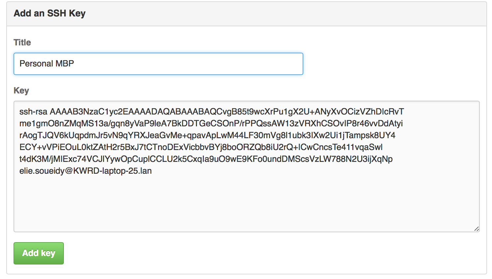
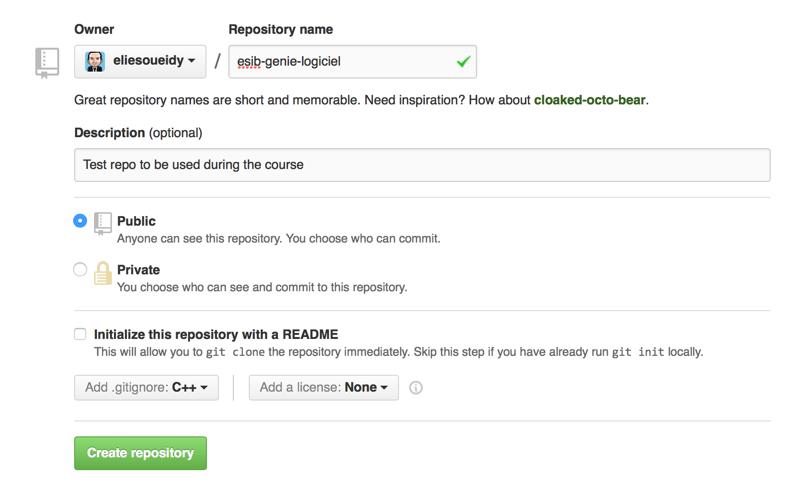
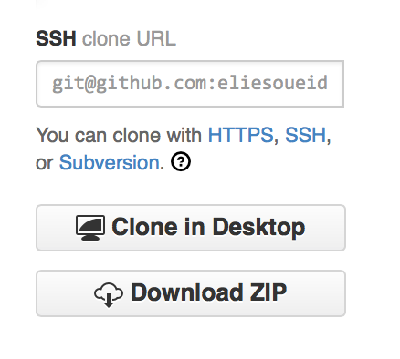

presentation-2014
=================

On va utiliser cette repo pour collaborer pendant le cours de Génie Logiciel.

## Configuration du compte Github

> On considère que vous avez déjà créé votre compte Gihub.

### 1- Après avoir créé un compte Github, la première étape est de configurer votre SSH public key.
Git se base sur le protocole SSH pour la communication et utilise la paire clé publique/clé privée pour identifier l’utilisateur et ses permissions. Pour cela, il faut aller sur Gihub dans **Settings -> SSH Keys** et cliquer sur **Add SSH key**.

Sur les systèmes Linux/Unix, vous utilisez la ligne de commande pour générer votre paire de clés:

```
ssh-keygen -t rsa
Generating public/private rsa key pair.
Enter file in which to save the key (/Users/elie.soueidy/.ssh/id_rsa):
Enter passphrase (empty for no passphrase):*********
Enter same passphrase again:**********
```
Cette commande va créer 2 nouveaux fichiers dans le répertoire `~/.ssh`: `id_rsa` et `id_rsa.pub`.

- `id_rsa` est votre clé privée. Il ne faut jamais la partager.
- `id_rsa.pub` est votre clé publique. C’est celle que vous allez ajouter sur Github. Il suffit d’ouvrir ce fichier dans votre éditeur de texte et de copier son contenu et le coller dans Github.



### 2- La 2ème étape consiste à créer votre repository.
Cliquer sur le bouton + puis New repository.


Il faut donner un nom à la repository. Les champs qui restent sont optionnels. On va parler des détails durant la présentation.



### 3- La 3ème étape consiste à télecharger une copie de la repository.
Github nous donne la URL de la repository pour pouvoir y accéder.



Sur la ligne de commande, éxecutez la commande:

```
git clone URL_FROM_GITHUB
```

Par exemple:

```
> git clone git@github.com:eliesoueidy/esib-genie-logiciel.git
Cloning into 'esib-genie-logiciel'...
remote: Counting objects: 3, done.
remote: Compressing objects: 100% (2/2), done.
Receiving objects: 100% (3/3), done.
remote: Total 3 (delta 0), reused 0 (delta 0)
Checking connectivity... done.
```
Cette commande va créer un répertoire nommé `esib-genie-logiciel` et va copier le contenu de la repository dedans (rien pout le moment).

## Installation de Git sur votre machine
Pour installer Git sur votre machine:

- **Ubuntu/Debian Linux**: `sudo apt-get install git`
- **Mac**: `Git` est installé par défaut avec `Xcode`. Si vous n’avez pas `Xcode`, utilisez la commande: `xcode-select --install` pour installer les `Command line tools`.
- **Windows**: `My Computer -> Disk C: -> Right click -> Format. Installez Linux`. Ou bien, si vous insistez, vous pouvez installer `msysGit`: http://msysgit.github.io


On va couvrir pendant la présentation les commandes de base de `Git`. Pour une référence complète, consultez: http://git-scm.com